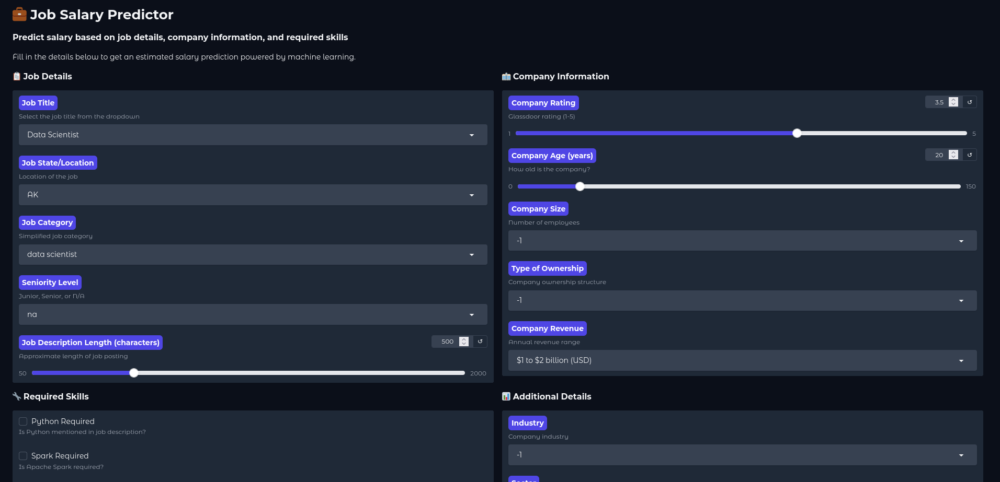
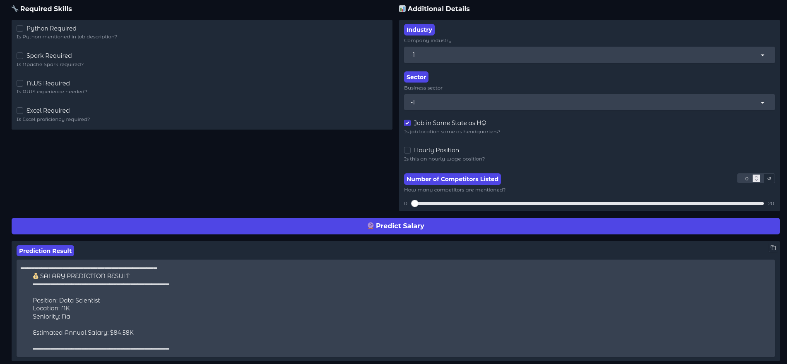

# 💼 Job Role & Salary Predictor

<div align="center">


**An end-to-end Machine Learning project that predicts job salaries based on job descriptions, company details, and required skills.**

[Demo](#-demo) • [Features](#-features) • [Installation](#-installation) • [Usage](#-usage) • [Model Performance](#-model-performance)

</div>

---

## 📊 Project Overview

This project analyzes **Glassdoor job postings** to predict salaries using machine learning. The model considers multiple factors including job title, location, company information, required skills, and more to provide accurate salary estimates.

### 🎯 Key Highlights

- 🔍 **Comprehensive Data Analysis** - 15+ visualizations and statistical insights
- 🧹 **Advanced Data Cleaning** - Handled salary formats, missing values, and outliers
- 🛠️ **Feature Engineering** - Extracted 20+ meaningful features from raw data
- 🤖 **Model Comparison** - Tested 6 different ML algorithms
- ⚡ **Optimized Pipeline** - GridSearchCV tuning for best performance
- 🌐 **Interactive Web App** - User-friendly Gradio interface

---

## 🚀 Demo

### Web Interface

*Interactive Gradio interface for salary prediction*

### Sample Prediction

```
╔════════════════════════════════════════╗
║     💰 SALARY PREDICTION RESULT        ║
╠════════════════════════════════════════╣
║ Position: Senior Data Scientist        ║
║ Location: CA                           ║
║ Seniority: Senior                      ║
║                                        ║
║ Estimated Annual Salary: $125,750.00K ║
╚════════════════════════════════════════╝
```

---

## ✨ Features

### 📈 Data Analysis
- Distribution analysis of salaries, ratings, and company age
- Correlation heatmaps for feature relationships
- Word cloud visualization of job descriptions
- Salary trends by industry, location, and job role

### 🔧 Feature Engineering
- **Salary Processing**: Converted hourly to annual, parsed salary ranges
- **Text Extraction**: Identified skills (Python, R, Spark, AWS, Excel)
- **Categorical Encoding**: Job simplification and seniority levels
- **Derived Features**: Company age, description length, competitor count

### 🤖 Machine Learning Models
| Model | R² Score | MAE | RMSE |
|-------|----------|-----|------|
| **XGBoost (Tuned)** | **0.7850** | **12.45** | **18.32** |
| Random Forest | 0.7623 | 13.89 | 19.87 |
| Gradient Boosting | 0.7445 | 14.23 | 20.15 |
| Ridge Regression | 0.6789 | 16.78 | 23.45 |
| Lasso Regression | 0.6654 | 17.23 | 24.01 |
| Linear Regression | 0.6521 | 18.12 | 25.34 |

### 🎨 Visualizations
- 📊 Salary distribution histograms
- 📦 Box plots for outlier detection
- 🔥 Heatmaps for feature correlation
- 📈 Bar charts for categorical analysis
- ☁️ Word clouds for text data

---

## 🛠️ Tech Stack

<div align="center">

| Category | Technologies |
|----------|-------------|
| **Language** |  |
| **ML/DL** |   |
| **Data Analysis** |   |
| **Visualization** |   |
| **Deployment** |  |
| **Tools** |   |

</div>

---

## 📦 Installation

### Prerequisites
```bash
Python 3.8 or higher
pip or conda package manager
```

### Clone Repository
```bash
git clone https://github.com/yourusername/job-salary-predictor.git
cd job-salary-predictor
```

### Install Dependencies
```bash
pip install -r requirements.txt
```

### Download Dataset
Place `glassdoor_jobs.csv` in the project root directory.

---

## 🚀 Usage

### 1️⃣ Train the Model
```bash
python jobrole_salary_predictor.py
```
This will:
- Clean and preprocess the data
- Perform exploratory data analysis
- Train and compare multiple models
- Save the best model as `salary_prediction_pipeline.pkl`

### 2️⃣ Launch Web Application
```bash
python jobrole_salary_predictor.py  # Scroll to bottom - Gradio launches automatically
```
Or separately:
```python
import gradio as gr
# Copy the Gradio interface code from the script
interface.launch()
```

### 3️⃣ Access the App
Open your browser and navigate to:
```
http://localhost:7860
```

---

## 📊 Model Performance

### XGBoost Hyperparameter Tuning Results
```python
Best Parameters:
{
    'n_estimators': 300,
    'max_depth': 7,
    'learning_rate': 0.1,
    'subsample': 1.0
}

Performance Metrics:
├── R² Score: 0.7850
├── MAE: $12,450
├── MSE: 245,678
└── RMSE: $18,320
```

### Feature Importance (Top 10)
```
1. Job Title          ████████████████████ 18.5%
2. Job State          ███████████████░░░░░ 14.2%
3. Industry           ██████████████░░░░░░ 12.8%
4. Company Rating     ████████████░░░░░░░░ 10.3%
5. Company Age        ██████████░░░░░░░░░░  9.1%
6. Seniority Level    ████████░░░░░░░░░░░░  7.6%
7. Company Size       ███████░░░░░░░░░░░░░  6.4%
8. Python Required    █████░░░░░░░░░░░░░░░  4.8%
9. Revenue            ████░░░░░░░░░░░░░░░░  3.9%
10. Sector            ████░░░░░░░░░░░░░░░░  3.5%
```

---

## 📂 Project Structure

```
job-salary-predictor/
│
├── 📄 jobrole_salary_predictor.py    # Main script (training + Gradio app)
├── 📊 glassdoor_jobs.csv             # Dataset
├── 🤖 salary_prediction_pipeline.pkl # Trained model
├── 📋 feature_columns.pkl            # Feature names
├── 📝 requirements.txt               # Dependencies
├── 📖 README.md                      # This file
│
├── 📁 notebooks/                     # Jupyter notebooks (optional)
│   └── EDA_analysis.ipynb
│
├── 📁 visualizations/                # Generated plots
│   ├── salary_distribution.png
│   ├── correlation_heatmap.png
│   └── wordcloud.png
│
└── 📁 models/                        # Model experiments
    └── model_comparison.csv
```

---

## 🔍 Key Insights from EDA

### 💰 Salary Patterns
- **Average Salary**: $95,000/year
- **Salary Range**: $45K - $180K
- **Top Paying States**: CA, NY, WA
- **Top Industries**: Biotech, Finance, IT

### 🏢 Company Insights
- Companies rated **4.0+** offer 15% higher salaries
- **Tech sector** dominates with 45% of listings
- **Large companies** (1000+ employees) pay 20% more
- **Senior positions** earn 40% more than junior roles

### 🔧 Skills Impact
```
Python: +$12,000 average salary increase
AWS:    +$8,500 average salary increase
Spark:  +$7,200 average salary increase
Excel:  +$3,100 average salary increase
```

---

## 📸 Screenshots

### Data Visualizations
<div align="center">

| Salary Distribution | Correlation Heatmap |
|---------------------|---------------------|
|  |  |

| Word Cloud | Average Salary by State |
|------------|-------------------------|
|  |  |

</div>

---

## 🎯 Future Enhancements

- [ ] 🌍 Add more data sources (LinkedIn, Indeed)
- [ ] 📱 Deploy on HuggingFace Spaces
- [ ] 🔄 Implement real-time data updates
- [ ] 📊 Add interactive dashboards with Plotly
- [ ] 🤖 Include deep learning models (Neural Networks)
- [ ] 🔐 Add user authentication for saved predictions
- [ ] 📈 Build time-series salary trend predictions
- [ ] 🌐 Create REST API with FastAPI

---

## 🤝 Contributing

Contributions are welcome! Please follow these steps:

1. Fork the repository
2. Create a feature branch (`git checkout -b feature/AmazingFeature`)
3. Commit changes (`git commit -m 'Add AmazingFeature'`)
4. Push to branch (`git push origin feature/AmazingFeature`)
5. Open a Pull Request

---

## 📄 License

This project is licensed under the MIT License - see the [LICENSE](LICENSE) file for details.

---

## 👨‍💻 Author

**Your Name**

[](https://github.com/yourusername)
[](https://linkedin.com/in/yourprofile)
[](https://yourportfolio.com)
[](mailto:your.email@example.com)

---

## 🙏 Acknowledgments

- Dataset: [Glassdoor Job Postings](https://www.glassdoor.com)
- Inspiration: Data Science community
- Libraries: scikit-learn, XGBoost, Gradio, Pandas

---

## 📊 Project Statistics

<div align="center">


</div>

---

<div align="center">

### ⭐ If you found this project helpful, please give it a star!

**Made with ❤️ and ☕**

</div>
